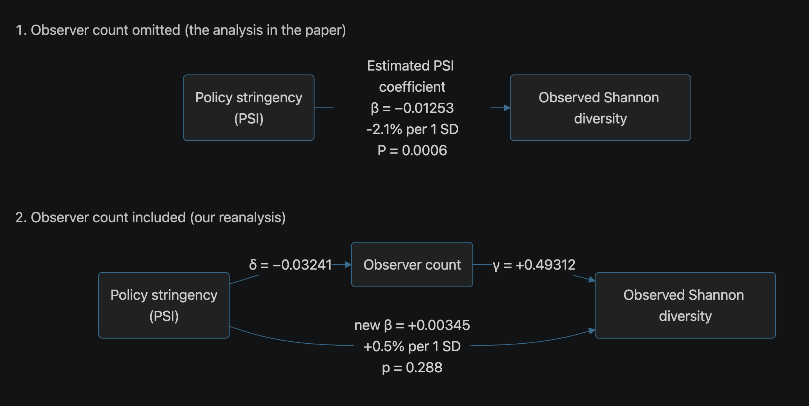
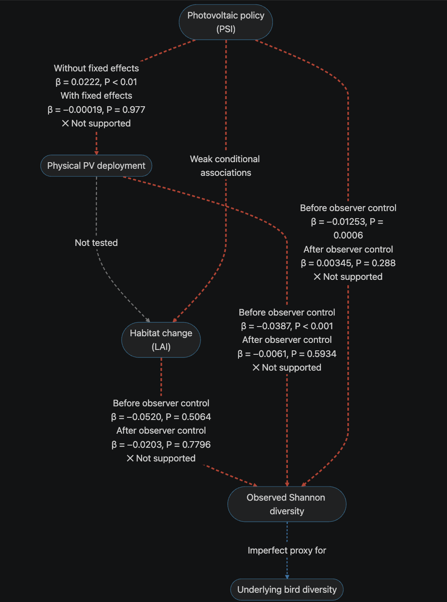

# Reanalysis of PSI and bird diversity

This repository contains two concise, self-contained reanalysis notebooks for the data from *China's solar expansion policy reduces bird diversity*.

- `01_replication_and_coefficient_reanalysis.ipynb` reconstructs the released analysis results presented in the paper, reproduces the principal fixed-effects and instrumental variable estimates, decomposes the reported R-squared values, checks the PSI-to-area pathway.
- `02_citizen_science_sampling_reanalysis.ipynb` examines the duration-per-observer variable, reporting discontinuities, sample inclusion, observer count, total observation time, sampling effort-adjusted outcomes, and IV sensitivity to observer count.

The notebooks have been executed from top to bottom and retain their outputs. Matching HTML exports are included for reading without Jupyter.

To see analysis and annotation, click on:
- [Notebook 1: Replication and coefficient reanalysis](./scripts/01_replication_and_coefficient_reanalysis.ipynb)
- [Notebook 2: Citizen science sampling reanalysis](./scripts/02_citizen_science_sampling_reanalysis.ipynb)

To read the comment manuscript (recommended), click and download:
- [Our bioRxiv preprint]([./Reanalysis-Science-PSI-ShannonBD_Aug25_2026_for_submission.pdf](https://www.biorxiv.org/content/10.64898/2026.08.25.746390v1))

## Archived code and manuscript

Available at Zenodo: https://zenodo.org/records/22102223


## Folder layout

Run the notebooks from this `scripts/` folder. They read the adjacent `../DATA/` folder and import only the local helper modules listed below:

- `load_data.py` builds the released analysis panel.
- `regression_utils.py` fits the fixed-effects models with PyFixest.
- `iv_observer_sensitivity.py` reproduces the IV model and observer-count sensitivity analysis.

The released data are read only; the notebooks do not modify files in `../DATA/`.

## Main findings

1. **Sampling effort is the central problem.** Observed Shannon diversity reflects both the underlying bird community and the observation process. PSI is associated with sample inclusion, observer count, and total observation time. Adding observer count changes the fixed-effects estimate from −2.10% (*P* = 0.0006) to +0.58% (*P* = 0.288), reduces the IV estimate to near zero (*P* = 0.912), and strongly attenuates the richness association.

2. **Poor data quality and erroneous preprocessing.** Pooling checklists into county-month aggregates removes information on protocol, duration, distance, completeness, observer identity, and observer skill. The duration-per-observer variable also discards total sampling scale, while the released data contain implausible values, internal inconsistencies, and pronounced temporal shifts in coverage and reporting.

3. **The proposed causal and mechanistic pathways are not supported.** PSI is not associated with photovoltaic area under the study’s fixed-effects specification, the deployment-to-habitat link was not tested, and the photovoltaic-area and LAI associations with observed diversity disappear or remain nonsignificant after observer adjustment.

4. **The reported high R² values are dominated by fixed effects.** PSI partial R² is only 0.048% for Shannon diversity and 0.36%, 2.57%, and 0.75% for NDVI, nighttime lights, and LAI, respectively.

5. **The released data cannot distinguish ecological change from changes in sampling coverage and detectability.** Neither the original −2.10% estimate nor the observer-adjusted +0.58% estimate should be interpreted as the true ecological effect. Their sensitivity shows that the claimed negative causal effect is not identified by the released aggregates.

6. **Causal claims from large observational datasets should be treated with caution.** Statistical significance alone does not establish ecological importance or causal identification. Researchers applying methods to ecological data should collaborate closely with ecologists familiar with the data-generating and observation processes.


## Install

Python 3.11 was used for the saved results. From this folder, create an isolated environment and install the recorded dependencies with:

```bash
python3.11 -m venv .venv
source .venv/bin/activate
python -m pip install -r requirements.txt
```

## Run

Execute both notebooks and retain the new outputs:

```bash
jupyter nbconvert --to notebook --execute --inplace 01_replication_and_coefficient_reanalysis.ipynb
jupyter nbconvert --to notebook --execute --inplace 02_citizen_science_sampling_reanalysis.ipynb
```

Regenerate the readable HTML files after execution:

```bash
jupyter nbconvert --to html 01_replication_and_coefficient_reanalysis.ipynb
jupyter nbconvert --to html 02_citizen_science_sampling_reanalysis.ipynb
```

## Estimation notes

- The principal models absorb county and exact year-month fixed effects and cluster standard errors by county.
- Fixed-effects OLS uses PyFixest's recursive singleton removal. The authors' IV code specifies Stata's `keepsingleton`, so the IV reproduction uses `fixef_rm="none"`.
- The PyFixest small-sample correction is configured to match the released Stata specifications.

## DAGs


## Mechanistic and physical pathways

